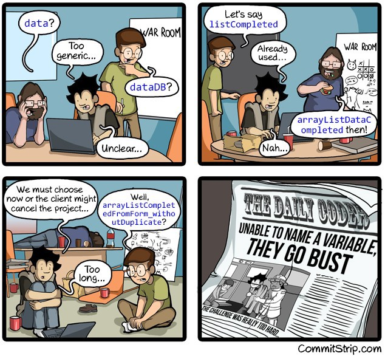

Programming is a way to _communicate_ with computers by giving instructions to them in order to perform a particular task. Thus our act of writing codes is a form of communication not only with machines but also with other developers.

The word **communication** is defined as an exchange of information between two or more persons. This exchange can happen in four ways: verbal, nonverbal, written, and visual. Each form has its conventions and methods to make the sharing of information effective. For example, consider written communication. Apart from having a particular syntax of a language, we also have certain conventions that help readers to grasp information easily such as lines between paragraphs, **bold** and _italic_ words, etc. Without following these styles, this article will look as shown below.

```
Coding Standards in Java
Programming is a way to communicate with computers by giving instructions to them in order to perform a particular task. Thus our act of writing codes is a form of communication not only with machines but also with other developers.
The word communication is defined as an exchange of information between two or more persons. This exchange can happen in four ways: verbal, nonverbal, written, and visual. Each form has its conventions and methods to make the sharing of information effective. For example, consider written communication. Apart from having a particular syntax of a language, we also have certain conventions that help readers to grasp information easily. Without following those styles, this article will look as shown below.
```

The information is still present, but not in an effective way to be read easily. Since coding is also a form of written communication, it is good practice to follow certain standards which will make them easy to be understood by other developers.

> Most of the time,we do not only write code just for a machine to understand but also to be understood by other developers since they may need to read the code and change them, fix bugs, or add more features.

# Benefits of following the standards

-   Compliance with industry standards.
-   Most Softwares are not maintained by the original author for its whole life. Thus fixing bugs and adding new features become  _easy_  and  _time saving_  for any other developer.
-   Consistent code quality and structure — no matter who writes the code.
-   When we ship our source code as a product, we need to make sure it is as well packaged and clean as any other product we create. Following standards assures this.

# Why developers don’t do it

Although all this “following the standards” makes sense, there are lots of developers out there who just are not able to follow them. Lets us look at some of those obstacles :

-   **Lack of knowledge base**: This applies to starters or to junior developers who do not have much exposure to writing clean codes.
-   **Lack of motivation**: This applies to a few developers who do not get much to do good work. They lack a  _work ethic_.
-   **Lack of time**: When developers are faced with tight deadlines, they may choose to focus first on solving the task and then on writing clean codes.

> Writing poor codes may be faster in the short term but when we have taken time and effort into our code’s design, adding new features, fixing bugs, and collaborating with other developers becomes much easier.

# Java Coding Standards

Let us dive into some of the important standards being followed across the industry. These are not strict rules, but a guideline to adhere to as a good programming practice which will make your life as well as of those who read your code easier.

## 1. Naming Conventions

-   **Package names**  are typed in lowercase e.g.  `javax.sql`, `com.newpackage`,  `java.lang`. Some not preferable ones are e.g.  `com.newPackage`,  `com.new_package`.
-   **Class**,  **enum**,  **interface**, and  **annotation**  names are typed in UpperCamelCase e.g.  `Thread`, `Runnable`, `Person`.
-   **Constants**  are types in uppercase separated by an underscore e.g.  `SIZE`,  `MIN_VALUE`,`MAX_VALUE`.
-   **Methods**  names are verbs and are typed in a lowerCamelCase e.g.  `deleteCharAt()`, `add()`, `isNull()`.
-   **Variables**  are typed in lowerCamelCase e.g.  `employeeName`, `birthDate`, `email`. The name should be short and such that it tells the reader of the program what this variable stores.

```
Avoid                         |      Preferred
--------------------------------------------------------------------
int personIdentificationNumber; --> int personId;
Map<Integer,String> personMap; -->  Map<Integer,String> personsById;
String s;                      -->  String value;
```

-   Abbreviations should not be used as far as possible, but if used, should be documented.




## 2. Declarations

-   One declaration per line is recommended since it encourages commenting and enhances the clarity of code.
```
int studentId,totalMarks;    // Avoid

// Preferred
int studentId;
int totalMarks;

d = (c = a + b) + e;    // Avoid

// Preferred
c = a + b;
d = c + e;

// Avoid
argv++; argc--;
```

-   The  **static**/**class**  variables should be placed in the sequence: First  **public**  class variables,  **protected**,  **package/default**  level i.e. with no access modifier and then the  **private**.
-   Next, class  **constructors**  should be declared followed by the  **inner classes**, if applicable.
-   Local declarations that hide declarations at higher levels should be avoided. For example, the same variable name in an inner block as of the global variable should be avoided.
-   Declarations for  **local variables**  should be only at the beginning of blocks.
-   Numerical  **constants**  should not be coded directly.
```
// Avoid
String name = personsById.get(2906);

// Preferred
final int PERSON_ID = 2906;
String name = personsById.get(PERSON_ID);
```

## 3. Source File Organization

-   Each Java source file contains should contain a single  **class**  or  **interface**. Each class must be placed in a separate file.
-   The source file length should be lower than  `2,000 lines`  of code.
-   The maximum number of parameters in any class is preferred to be  `12`.
-   Lines out of the screen should be avoided. When an expression will not fit on a single line (more than  **70 to 120**  characters), it should be broken after a  _comma_  or an  _operator_.
```
count = number.calculate(bytes, offset, length,
               value, 0, estimatedCount);

long value = ((totalValue < plannedValue ) ?
                         totalValue : plannedValue );
```

-   Blank lines should be used to improve readability by grouping sections of code that are logically related.
-   All source files are preferred to have a  **documentation comment** that may contain information like Title, Version, Date, Author, etc. This is followed by  **`package`**  declaration, followed by a  **`class`**  comment
```
package com.somepackage;

/**
 * what this file is about
 *
 * [@author](http://twitter.com/author) a,b
 * [@date](http://twitter.com/date)
 * [@version](http://twitter.com/version)
 * [@copyright](http://twitter.com/copyright)
 *
 */

 import com.somepackage.OtherClass;

/*
 * Optional class comment
 *
 */
public class SomeClass {
  // codes
}
```

-   **Functions**  should normally be  **short**, between 5–15 lines but this is not an absolute rule. There may be cases where a function is a single large switch statement or sometimes having a larger function may be advantageous. But where ever applicable, try to stick to small function sizes.
-   The starting brace (`{`  ) should be at the end of the same line as the declaration statement or method and the ending brace (`}`  ) must be on a separate line and aligned with the conditional/class.
```
// Preferred
public class SomeClass {
  // codes
}

// Avoid
public class SomeClass
{
  // codes
}
```

-   All binary operators except “.” should be separated from operands using a space. For example,  `int value = a + b + 1;`  is preferred over`int value=a+b+1;`

## 4. Commenting Codes

There are two types of comments which are described as follows. Use them where ever applicable as it helps the person who is trying to figure out what a complex block of code, a method, or a class intended to do. Comments also help you to avoid situations as shown below.


-   **Documentation Comments**: These comments describe the specification of the code from an implementation-free perspective. This is written in HTML and must precede a class, field, constructor, or method declaration. It is made up of two parts — a description followed by block tags. We can then use Javadoc (a tool that comes with JDK) to generate Java code documentation in HTML format from Java source code. It must be written in specific formate (see this  [link](https://www.oracle.com/technical-resources/articles/java/javadoc-tool.html)).
-   **Implementation Comments**: These comments describe a particular implementation of the code. They are further divided into four types.

1.  **Block comment**:  used to provide descriptions of files, methods, data structures, and algorithms. Block comments should be used at the beginning of each file and in places where code is to be explained. It should be preceded by a blank line to set it apart from the rest of the code. This is also called a  _multi-line comment_.
```
/*
   Draws two lines which divides the window
   into four quadrants. First draws a horizontal
   line and then the vertical line
*/

line(0, 50, 100, 50);
line(50, 0, 50, 100);
```

2.  **Single line comment**:  Short comments can appear on a single line. This allows adding explanatory text to code.
```
// single-line comment**
if(x < y) {
    x = y % x;
}

/* also a single-line comment */
if(x < y) {
    x = y % x;
}
```

3. **Trailing comments**: These are used to explain a single line of code.
```
System.out.println(pi \u002A 4); // \u002A is Unicode of *
```

4. **End of line comment**: The  `//`  comment delimiter can comment out a complete line or only a partial line. It shouldn't be used on consecutive multiple lines for text comments; however, it can be used in consecutive multiple lines for commenting out sections of code.
```
//if (bar > 1) {
//
//    // Do a something
//    ...
//}
//else {
//    return false;
//}
```
It’s important to be **professional**  when writing comments. Consider the following comment from one of the StackOverflow  [answers](https://stackoverflow.com/a/482129/9381213). It may not be professional but it is definitely friendly!
```
//
// Dear maintainer:
//
// Once you are done trying to 'optimize' this routine,
// and have realized what a terrible mistake that was,
// please increment the following counter as a warning
// to the next guy:
//
// total_hours_wasted_here = 42
//
```
## 5. Miscellaneous

-   We should not document  `overrided`  method unless the implementation has changed.
-   Do not omit braces  `{}`  in conditionals. Wrap logical similar conditions and use proper indentations where ever applicable so that all statements are easy to read.
```
// Avoid
if (condition)
  statement;

// Avoid
if (x < 0) function(x);

// Preferred
if (condition) {
   statement;
}

// Preferred
if ((a == b) && (c == d)) {
    ...
}
```
-   In  `switch`  cases always have a  `default`  case even without code. Every time a case falls through (doesn’t include a  `break`  statement), add a comment  `/* falls through */`  where the  `break`  statement would normally be.
```
switch (condition) {
case ABC:
    statements;
    /* falls through */
case DEF:
    statements;
    break;
case XYZ:
    statements;
    break;
default:
    statements;
    break;
}
```
-   A  `return`  statement with a value should not use parentheses unless they make the return value more obvious in some way.
-   Messages should be properly indented and organized such that they are easy to read.
```
// Preferred
throw new CustomException("Failed to retrieve"
    + " request " + request.getId()
    + " for user " + user.getId()
    + " query: '" + query.getText() + "'");
```
These are some of the commonly used Java standards. You can read more about them on standard documentations ([oracle](https://www.oracle.com/java/technologies/javase/codeconventions-contents.html),  [google](https://google.github.io/styleguide/javaguide.html)). Have a look at  [this](https://www.oracle.com/java/technologies/javase/codeconventions-codeexamples.html)  properly formatted Java code example to see these conventions in practice.

# Intentionally making codes dirty

Java source code is typically compiled into Java  **bytecode**  — the instruction set of the  _Java virtual machine_. The compiled Java bytecode can be easily reverse-engineered back into source code through freely available  **decompilers**.

Hence a process called  **Code Obfuscation** is performed which modifies an executable so that it is no longer useful to a hacker but remains fully functional. Methods such as renaming, String encryption, dummy code insertion, etc are used to achieve obfuscation. A list of open-source tools for performing obfuscation in java can be found at this  [link](https://java-source.net/open-source/obfuscators).


But remember this is done on Java bytecode and not on the source code. We cannot use security as an excuse for not writing clean codes!

# Conclusion

Nowadays many IDEs such as  [IntelliJ](https://www.jetbrains.com/help/idea/reformat-and-rearrange-code.html)  or  [Eclipse](https://www.eclipse.org/pdt/help/html/formatting_code.htm)  already provide code formating options using which most of the coding conventions can be followed. We still need to add comments as they are not yet smart enough to also do that for us! Anyway, the take away is that we should write code in such a way that makes the life of future authors and maintainers easy.

If you found this article useful, do check my other  [article](https://medium.com/dev-genius/object-oriented-programming-in-java-57202e7c0abd?source=friends_link&sk=73629e76ceb5bc8ed32dff001cf2d325)  regarding object-oriented programming in Java.
