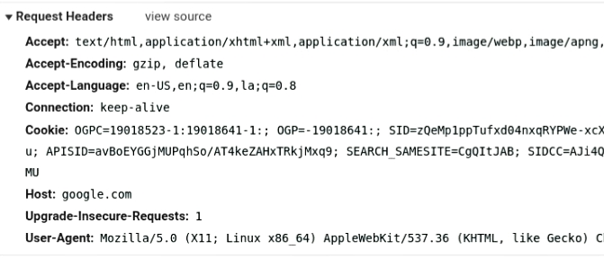
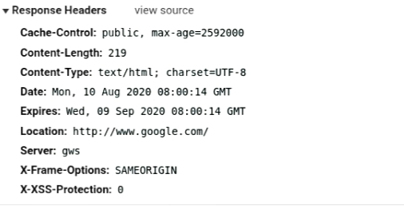

# HTTP Protocol Insights

In this blog, we will discuss the HTTP protocol

## **Introduction**

HTTP stands for hypertext transfer protocol, an application layer protocol. HTTP is the foundation for communication between clients and servers over the world wide web. It was developed by Tim Berners Lee and his team in 1991, since then it has evolved from being able to exchange files in a semi-trusted laboratory environment to be able to carry images and even HD videos across the web. The current version of HTTP is HTTP 2.0, and works on the default port 80.

HTTP based on a client-server architecture where any computer making a request is an HTTP client and computer capable of fulfilling the request is an HTTP server. HTTP operates by exchanging messages between HTTP clients and HTTP servers. the first request is sent is a TCP message. First TCP three-way handshake is completed then only HTTP message is being sent. HTTP depends on TCP for reliability.

HTTP client sends HTTP request to the server in the form a request message after receiving and processing the request message, a server responds with an HTTP response message, and that's why it is also called as a request-response protocol

## **Features of HTTP**

* HTTP is a stateless protocol that means HTTP is not going to maintain any information about the users. Every request is new and separate from any previous request.

* HTTP is inband which means that data and commands will go in the same connection and no distinction made between data and commands.

* HTTP 1.0 uses non-persistent connection which means a new connection will be created to fetch objects from the server.

* HTTP 1.1 uses persistent connection which means only one connection will be created to fetch all the objects from the server.

* HTTP is media independent which means that any type of data can be transmitted by HTTP but it is required for the client as well as the server to specify the content type.

## **HTTP Message Format**

There are two types of messages, requests, and responses. All communication takes place via these messages. these messages are text-based and follow certain fixed formate. the formate is as follows

    start line - conveys the nature of message

    message header - contains message header as "header name" : "header value"

    empty line - separates header and body

    message body - the content of the message

* ### Request Message Format

    request line  
    request headers  
    empty line  
    message body

    

* ### Response Message Format

    status line  
    response header  
    empty line  
    message body

    

## **HTTP Headers**

There is an information exchange between client and server which can be of different types, different encoding. There should be a way of telling each other that what type of data is being transmitted and how it can be decoded, what is the size of data so that server can cross-check. The headers are nothing but the data about data, the metadata.  

With HTTP headers the client and the server can pass additional information. An HTTP header consists of name and value pair where the name is case-insensitive followed by a colon, then its value.  

Http header can be grouped into 4 categories.

1. Request-header
2. Response-header
3. Entity-header
4. General-header

### **Request-header**

These header fields are applicable only for request messages, give details about the nature of requests. It allows the client to provide information about itself to the server. It allows the client to have greater control over the request.  

* #### ***Accept***

    This header tells the server what content the client accepts. while fetching a CSS file a different value is set than fetching a video or image.  
  * syntax  
        Accept: <MIME_type>/<MIME_subtype>  
        Accept: <MIME_type>/*  
        Accept: +/+  
  * example  
        Accept: text/HTML  
        Accept: image/*
        Accept:+/+  

* #### ***Accept-Language***

    The Accept-Language request HTTP header tells the server which languages the client can understand ie which language is preferred. Using content negotiation, the server then uses one of the mentioned languages, in the response, and also the server can mention the language it uses with the response header Content-Language.  
  * Syntax  
        Accept-Language: "language"  
        Accept-Language: *  
  * Examples  
        Accept-Language: en-us

### **Response-header**

 These header fields have applicability only for response messages. It provides information about the server like apache server or NX server.  

* #### ***Access-Control-Allow-Origin***

    It is an important header because it specifies which website can participate in cross-origin resource sharing so its a browser security mechanism by default you are not allowed to load content from different sites. So it specifies whether a resource can be shared with a given request from a given origin.

  * Syntax  
        Access-Control-Allow-Origin: *  
        Access-Control-Allow-Origin: "origin"  
        Access-Control-Allow-Origin: null  
  * Examples  
        Access-Control-Allow-Origin: *  
        with this response, the server tells the browser to allow requesting the resource from any origin.  
        Access-Control-Allow-Origin: <https://abcd.pqrs.com>  
        with this response, the server tells the browser to allow requesting the resource from origin <https://abcd.pqrs.com>

### **Entity-header**

These headers describe the content of the body of the message. Define meta-information about the body. These headers are used in both request and response header for example content-length.

* #### ***Content-Length***

    The Content-Length indicates the size of the message body, in bytes.reciepient can use this information to verify the data it received matches the specified size or not.
  * Syntax  
         Content-Length: "length"

* #### ***Allow***

    The Allow header lists the set of methods supported by a resource, for request with any other method server will respond with a 405 status code which says that method is not allowed.
  * Syntax
        Allow: "http-methods"
  * Examples
        Allow: GET, PUT

### **General-header**

 General headers are applicable to both client and server.  

* #### ***Connection***

    The connection is general-header which allows the sender to specify that after the current transaction the connection should be kept alive or it should be terminated.

  * example  
        Connection: keep-alive
        Connection: close
        Closed specify that the sender wants to terminate the connection after this transaction
        Keep-alive-specify that the sender doesn't want to terminate the connection after the current transaction.

## **Status Codes**

HTTP status codes provide a way for the server to communicate to the client in a structured way so that both the server and client can understand what exactly is going on. A really common code that all of us have seen before is 404 which essentially means the resource, the client wants to access was not found on the server.
The HTTP status line in the response message contains a status code. The code is in both numeric(status code) and text(response phrase) form like 200 OK.  
There are five categories of code  

### ***1x Informational***

* **100 Continue**

    It indicated that the client should continue with its request, this response code is used to inform the client that the server has accepted the request and not been rejected yet.

### ***2x Success***

    These codes essentially mean that the request you made was a good request, it was successful, completed correctly, it did what it suppose to do.

* ***200 OK***  
    This status code is the most commonly used code which says that the request was successful.

* ***201 Created***  
    In case of when you are creating a resource on the server and if it successfully created then 201 status code is sent from server to client.

* ***204 No Content***  
    204 status essentially means that operation went well, worked as expected but the server has nothing to return.

### ***3x Redirection***

    These codes handle the redirection if sever wants to redirect the client to another URL, the client will get 300 as status code from the first URL.

* ***301 Moved Permanently***  
    This status code is used by the server when a URL is permanently replaced by another URL, users will be permanently sent to a new URL. new URL replaces the old URL in search results, so any time site migration is performed this status code is used.

* ***304 Not Modified***  
    Whenever a file is unchanged since it is last accessed on the server. when the client requests with the If-Modified-Since header if the files haven't been modified request will not be fulfilled and the cached version will be served.

### ***4x Client Error***

    These codes represent client error like the client requests a resource that is not available or something wrong with the request.

* ***401 Unauthorized***  
    When login credentials are not correct the server responds with a 401 status code.

* ***404 Not Found***  
    When a user wants to access a resource on the server which doesn't exist on the server or if the user attempts to follow a dead link then the server responds back with a 404 status code. This status code doesn't indicate whether the resource user looking for is temporarily not available or permanently. It is the most common error.

### ***5x Server Error***

    This status code essentially represents that something went wrong on the server-side. The server responds with this status code if the client makes a good request but the server not able to complete the request.

* ***500 Internal Server Error***  
    This status code conveys that there is a problem in the server, the server is not able to complete the request.

* ***503 Service Unavailable***  
    503 Error is usually an expected error unlike 500, suppose you want to access a resource for which you have to pay the bill but you didn't pay then you will get the 503 error.

## **HTTP Methods**

    The method is nothing but a command for the client to prompt the server to take action. Some of the common methods are GET and POST however there are more methods.

* **GET**  
    The method is used when you want to get some resources from the server. With GET, the method parameter can be sent but up to a certain limit. In the GET method, the parameter is visible in the URL and therefore less safe for operations like authentication.

* ***POST***  
    POST requests are used to send data to a server to create or update a resource. The information submitted to the server with the POST request method is sent in the request body of the HTTP request, hence it doesn't use the query string to send data. The HTTP POST method is often used to send user-generated data to a server. One of the examples is when a user uploads a profile photo.

* ***PUT***  
    PUT is similar to POST as it is used to send data to the server to create or update a resource. The difference between the two is that PUT requests are the same result even if it is called multiple times.

* ***DELETE***  
    DELETE request method is used to delete resources from the server indicated by a specific URL. Making a DELETE request will remove the targeted resource.

## **Limitations of HTTP**

* HTTP is less secure because the data transferred in form of text and anyone can do man-in-middle attack and can listen to traffic.

* HTTP is unencrypted that's why the man-in-middle attack is possible, the data can tamper, one can change the data and forward thus it is less reliable.
